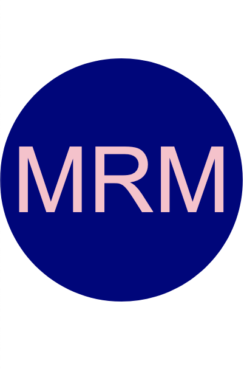
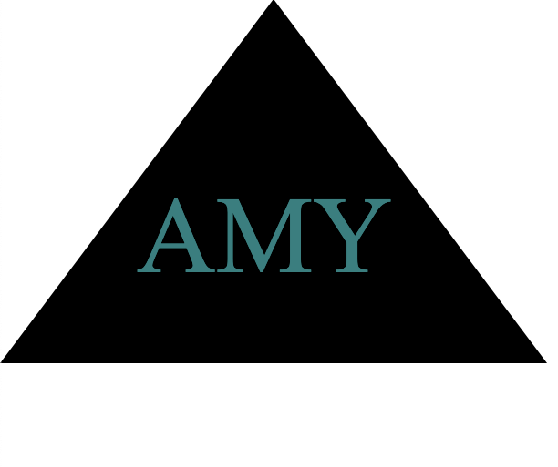

# Vectorly

## Description

This Node.js command-line application rapidly generates a custom SVG logo. It prompts the user to choose a shape, text, shape color, and font family, then saves the resulting design to an .svg file.

## Table of Contents

- [Installation](#installation)
- [Usage](#usage)
- [Screenshots](#screenshots)
- [Link](#link)
- [Contribution](#contribution)
- [Tests](#tests)
- [License](#license)
- [Questions](#questions)

## Installation

This application necessitates Node.js version 16 and above and the Inquirer package version 8.2.4. To install the project's dependencies, execute the following command in the terminal: `npm install`.

## Usage

1. Clone the repository and open the project in your text editor.
2. In the terminal, enter the command `npm start`.
3. Answer the questions provided.
4. Your logo.svg file will be automatically created for you.
5. Open up your logo.svg file in the browser to view your new logo.

## Screenshots

## Link

[Github Repository](https://github.com/matthew-millard/vectorly)

[Walkthrough Demonstration]()

## Contribution

You can participate in this project by submitting and verifying bugs/feature requests, reviewing code changes, and improving documentation through pull requests.

## Tests

The applications' tests use the JavaScript testing framework Jest. To run the tests enter the command "npm test"  in the terminal.

## License

MIT License
A short and simple permissive license with conditions only requiring preservation of copyright and license notices. Licensed works, modifications, and larger works may be distributed under different terms and without source code.

## Questions

If you have any questions related to this project, please don't hesitate to email me: [matthew.richie.millard@gmail.com](mailto:matthew.richie.millard@gmail.com).
If you would like to check out my other projects on Github: [matthew-millard](https://github.com/matthew-millard).
